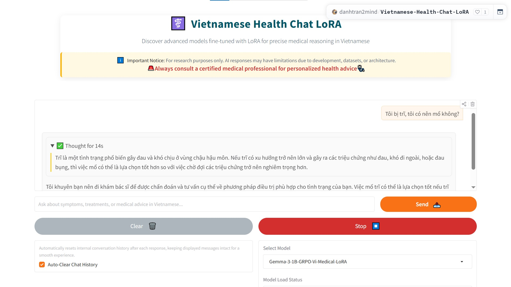

# Vietnamese Health Chat LoRA

> ℹ️ Important Notice: For research purposes only. AI responses may have limitations due to development, datasets, or architecture.
> 🚨Always consult a certified medical professional for personalized health advice🩺

## Introduction


## Key Features

## Notebooks
### `gemma-3-1b-grpo-vi-medical-lora` Notebook:
notebooks\gemma-3-1b-grpo-vi-medical-lora.ipynb
### `gemma-3-1b-it-vi-medical-lora` Notebook:
notebooks\gemma-3-1b-it-vi-medical-lora.ipynb
### `llama-3-2-1b-it-vi-medical-lora` Notebook:
notebooks\llama-3-2-1b-it-vi-medical-lora.ipynb
### `llama-3-2-3b-it-vi-medical-lora` Notebook:
notebooks\llama-3-2-3b-it-vi-medical-lora.ipynb
### `llama-3-2-3b-reasoning-vi-medical-lora-training` Notebook:
notebooks\llama-3-2-3b-reasoning-vi-medical-lora-training.ipynb
### `qwen-3-0-6b-it-vi-medical-lora` Notebook:
notebooks\qwen-3-0-6b-it-vi-medical-lora.ipynb
### `qwen-3-0-6b-reasoning-vi-medical-lora` Notebook:
notebooks\qwen-3-0-6b-reasoning-vi-medical-lora.ipynb

## Dataset
All LoRA modles are trained on **HuggingFace Space**: [](https://huggingface.co/datasets/tmnam20/ViMedAQA)

## Base Model
- https://huggingface.co/google/gemma-3-1b-it
- https://huggingface.co/meta-llama/Llama-3.2-1B-Instruct
- https://huggingface.co/meta-llama/Llama-3.2-3B-Instruct
- https://huggingface.co/Qwen/Qwen3-0.6B
## Demonstration
Experience the magic of Ghibli-style video generation:  
- **HuggingFace Space**: [](https://huggingface.co/spaces/danhtran2mind/Text2Video-Ghibli-style)

- **Demo GUI**:  
  

To run the Gradio app locally (`localhost:7860`):  
```bash
python apps/gradio_app.py
```

## Usage
### CLone Project
```bash
git clone https://github.com/danhtran2mind/Vietnamese-Health-Chat-LoRA
cd Vietnamese-Health-Chat-LoRA
```
### Install Dependencies
```bash
pip install -r requirements/requirements.txt
```

```bash
python apps/gradio_app.py
```
## Training
See [Notebooks](#notebooks) to get training processes of each LoRA model.
## Environment
- **Python**: 3.10 or higher
- **Key Libraries**: See [requirements_compatible.txt](requirements/requirements_compatible.txt) for compatible versions.

## Project Description

See detail LoRA models you can explore at:
https://huggingface.co/danhtran2mind/Gemma-3-1B-Instruct-Vi-Medical-LoRA
https://huggingface.co/danhtran2mind/Gemma-3-1B-GRPO-Vi-Medical-LoRA
https://huggingface.co/danhtran2mind/Llama-3.2-3B-Instruct-Vi-Medical-LoRA
https://huggingface.co/danhtran2mind/Llama-3.2-1B-Instruct-Vi-Medical-LoRA
https://huggingface.co/danhtran2mind/Llama-3.2-3B-Reasoning-Vi-Medical-LoRA
https://huggingface.co/danhtran2mind/Qwen-3-0.6B-Instruct-Vi-Medical-LoRA
https://huggingface.co/danhtran2mind/Qwen-3-0.6B-Reasoning-Vi-Medical-LoRA
